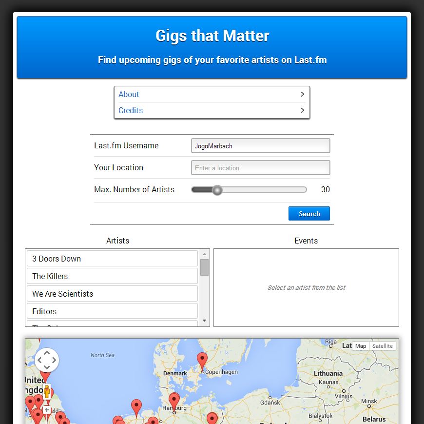

GigsThatMatter
==============

*Mirrors: [GitHub] ~ [GitLab]*

Web application that visualizes upcoming events of your top artists on
Last.fm

### About

The purpose of this web app is to provide quick access to upcoming
concerts of your favorite bands and artists on [Last.fm](http://www.last.fm).
The event locations are displayed in a list as well as on an interactive map.

### Usage

Simply load `src/index.html` in your web browser.

### Dependencies

The application heavily relies on the following APIs and libraries:

* [Last.fm API](http://www.last.fm/api)
* [Google Maps API](https://developers.google.com/maps/)
* [jQuery](http://jquery.com/)
* [jQuery Last.fm plugin](https://github.com/Johennes/jquery.lastfm)

### Screenshots

[GitHub]: https://github.com/Johennes/GigsThatMatter
[GitLab]: https://gitlab.com/cherrypicker/GigsThatMatter
